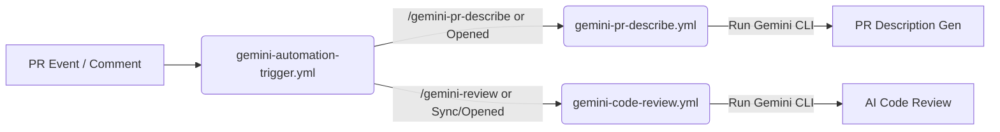

# GitHub Actions & Gemini AI Automation

이 디렉토리는 프로젝트의 CI/CD 및 자동화 워크플로우를 관리합니다. 특히 **Gemini AI를 활용한 자동 코드 리뷰 및 PR 명세 작성 시스템**의 구조와 로컬 테스트 방법을 설명합니다.

## 📂 워크플로우 구조 (Workflow Architecture)

이 프로젝트의 AI 시스템은 **Trigger(호출자)**와 **Worker(수행자)** 구조로 분리되어 있어, 재사용성과 유지보수성을 높였습니다.



### 1. `workflows/gemini-automation-trigger.yml` (Trigger)
*   **역할**: 이벤트 리스너 및 진입점 (Router).
*   **동작**:
    *   `pull_request` (opened, synchronize 등) 및 `issue_comment` 이벤트를 감지합니다.
    *   조건에 따라 적절한 Worker 워크플로우를 호출합니다.
        *   **PR Description**: PR이 `dev` 브랜치로 열리거나 `/gemini-pr-describe` 댓글이 달리면 `gemini-pr-describe.yml` 호출.
        *   **Code Review**: PR 동기화/Reopen 시, 혹은 `/gemini-review` 댓글이 달리면 `gemini-code-review.yml` 호출.

### 2. `workflows/gemini-code-review.yml` (Worker: Reviewer)
*   **역할**: AI 코드 리뷰 수행.
*   **주요 기능**:
    *   `google-github-actions/run-gemini-cli`를 사용하여 변경 사항을 분석.
    *   **MCP (GitHub Server)**: GitHub API를 통해 기존 리뷰를 읽고 중복을 방지하며, 새로운 이슈에 대해서만 코멘트를 남깁니다.
    *   사용자 명령어(`/gemini-review focus on ...`)가 있을 경우 해당 컨텍스트를 반영합니다.

### 3. `workflows/gemini-pr-describe.yml` (Worker: Writer)
*   **역할**: PR 본문(Description) 자동 작성.
*   **주요 기능**:
    *   PR의 변경 사항을 분석하여 `.github/pull_request_template.md` 형식에 맞춰 내용을 채웁니다 (What, Why, How, Test Check List).
    *   작성된 내용을 PR 본문에 업데이트합니다.

---

## 🛠 로컬 테스트 가이드 (`act` 사용)

GitHub에 푸시하지 않고도 로컬 환경에서 `act` 도구를 사용하여 워크플로우를 시뮬레이션할 수 있습니다.

### 사전 준비 (Prerequisites)
1.  **[act](https://github.com/nektos/act) 설치**
2.  **Docker 실행 중**이어야 함

### 설정 파일 준비
로컬 테스트를 위해 `.github/act/` 디렉토리에 다음 파일들이 필요합니다.

*   **이벤트 페이로드 (Event Payloads)**:
    *   `pull_request.json`: 기본 PR 이벤트.
    *   `comment_review.json`: `/gemini-review` 댓글 이벤트 시뮬레이션.
    *   `pr_opened_dev.json`: PR 생성(Opened) 이벤트 시뮬레이션.
*   **`secrets`**: 환경 변수 키값 파일.
    ```properties
    # .github/act/secrets 예시
    GEMINI_API_KEY_DONGWOO=your_api_key_here
    GITHUB_TOKEN=your_personal_access_token_here
    ```

### 실행 명령어 예시

**1. PR 코드 리뷰 트리거 테스트 (댓글 이벤트)**
```bash
act issue_comment \
  -W .github/workflows/gemini-automation-trigger.yml \
  -e .github/act/comment_review.json \
  --secret-file .github/act/secrets \
  -v
```

**2. PR 생성 시 자동 설명/리뷰 트리거 테스트**
```bash
act pull_request \
  -W .github/workflows/gemini-automation-trigger.yml \
  -e .github/act/pr_opened_dev.json \
  --secret-file .github/act/secrets \
  -v
```

---

## 🔑 주요 환경 변수 및 Secrets

| 이름 | 설명 | 비고 |
|------|------|------|
| `GITHUB_TOKEN` | GitHub API 호출을 위한 토큰 | 워크플로우 내 권한 상속 |
| `GEMINI_API_KEY_DONGWOO` | Gemini AI 모델 API 키 | `gemini-code-review.yml` 등에서 참조됨 |


```
